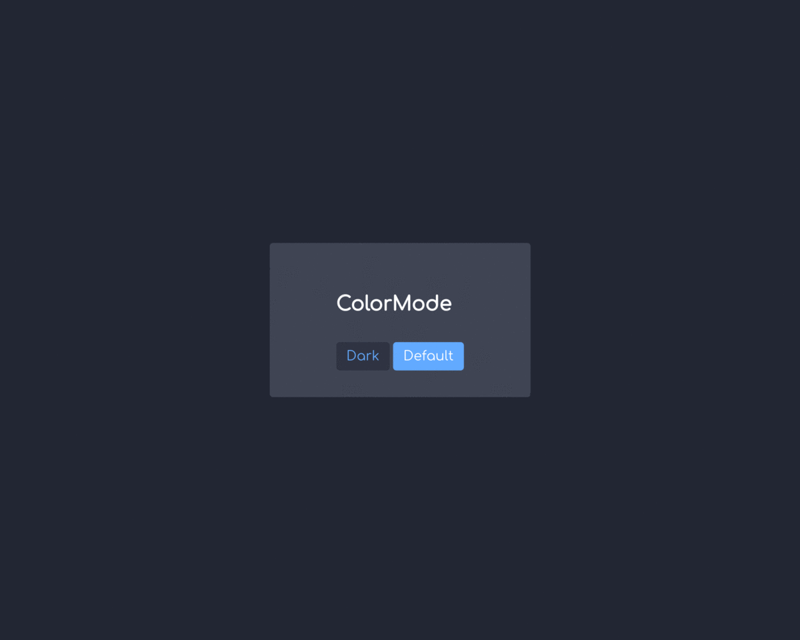

# ColorMode
🎨 Add color theme systme to your page with ColorMode!

## Install
```bash
npm install color-mode
```

OR Add to `<script>`  
[Download](https://github.com/leegeunhyeok/color-mode/releases)

## Usage

```html
<div class="wrap" colormode="bg:bgPrimary">
  <div class="panel" colormode="bg:bgSecondary">
    <h2 class="title" colormode="fg:labelPrimary">ColorMode</h2>
    <a id="dark" class="button" colormode="secondaryBtn">Dark</a>
    <a id="default" class="button" colormode="primaryBtn">Default</a>
  </div>
</div>

<script>

  // Bind button event
  window.onload = function () {
    document.getElementById('dark').addEventListener('click', function () {
      colorMode.set('dark')
    })

    document.getElementById('default').addEventListener('click', function () {
      colorMode.set('default')
    })
  }

  var option = {
    initialTheme: 'dark', // Init with dark
    fallbackTheme: 'default',
    animation: 200, // Transform effect duration(ms)
    tags: {
      fg: 'color',
      bg: 'background-color',
      primaryBtn: {
        backgroundColor: '@tint',
        color: '@onTint'
      },
      secondaryBtn: {
        backgroundColor: '@bgTertiary',
        color: '@tint'
      }
    },
    themes: {
      default: { // required!
        tint: '#007aff',
        onTint: '#ffffff',
        bgPrimary: '#e5e9f2',
        bgSecondary: '#ffffff',
        bgTertiary: '#eef3fc',
        labelPrimary: '#1d212b',
        labelSecondary: '#45566f'
      },
      dark: {
        tint: '#6db3ff',
        onTint: '#ffffff',
        bgPrimary: '#262b3a',
        bgSecondary: '#484d5d',
        bgTertiary: '#353a4b',
        labelPrimary: '#ffffff',
        labelSecondary: '#cfd3e0'
      },
      // You can add more custom themes
    }
  }

  // Create ColorMode instance
  var colorMode = new ColorMode(option)

</script>
```



- [DEMO](https://leegeunhyeok.github.io/color-mode/demo)
- [DEMO with Docs](https://leegeunhyeok.github.io/color-mode/docs)

## Document

Import ColorMode
```javascript
// NPM
import colorMode from 'color-mode'
```
```html
<!-- HTML Script -->
<script src="color-mode.min.js">
```

Create ColorMode instance
```javascript
var colorMode = new ColorMode(option)
```

### ColorMode
ColorMode Class
> ColorMode instance must be create once.

| Parameter | Type | Required |
|:--|:--:|:--:|
| option | object | O |

#### option
| Property | Type | Required | Default | Description |
|:--|:--:|:--:|:--|:--|
| initialTheme | string | X | `default` | Initial theme name  |
| fallbackTheme | string | X | `default` | Fallback theme name |
| animation | number | X | `0` | Theme transform effect duration |
| tags | [object](#optiontags) | O | none | Theme tags |
| themes | [object](#optionthemes) | O | none | Themes |

##### option.tags

| Key | Value | Type | Required |
|:--|:--:|:--:|:--:|
| `custom tag name` | CSS Property or Style object | string \| object | O |

- (string) CSS Property: `'color'`, `'background-color'`, `'box-shadow'`, ...
- (object) Style object: `{ color: 'dodgerblue', backgroundColor: '#e0e0e0', ... }`
  - Property name must be *CamelCase* `(background-color > backgroundColor)`
  - You can using theme's color with `@` (ex: `@NAME` find 'NAME' color from theme)

```javascript
/**
 * tags: {
 *   TAG_NAME: 'CSS Property',
 *   TAG_NAME: {
 *      boxShadow: '0 0 0 5px @primary' // Using theme's 'primary' named color
 *   }
 * }
 */

const option = {
  // ...
  tags: {
    myTag: ...,
    fg: 'color', // string (CSS Property)
    bg: 'background-color',
    detail: { // object (Style object)
      backgroundColor: '#2f2f2f',
      color: '@primary' // Find 'primary' color from 'option.themes.*'
    }
  }
}
```

##### option.themes

| Key | Value | Type | Required |
|:--|:--:|:--:|:--:|
| default | CSS Style (color code, etc..) | string | O |
| `custom theme name` | CSS Style (color code, etc..) | string | X |

- `default` theme required
- Define `custom theme name` if you want to add theme
  - Each theme has style name(s)

```javascript
/**
 * themes: {
 *   THEME_NAME: {
 *     STYLE_NAME: 'VALUE'
 *   }
 * }
 */

const option = {
  // ...
  themes: {
    default: { // required!
      tint: '#007aff',
      tint10: '#d8e7f9',
      onTint: '#ffffff',
      bgPrimary: '#e5e9f2',
      bgSecondary: '#ffffff',
      bgTertiary: '#eef3fc',
      panelBorder: '1px solid #007aff'
    },
    dark: {
      tint: '#6db3ff',
      tint10: '#e4ecf9',
      onTint: '#ffffff',
      bgPrimary: '#262b3a',
      bgSecondary: '#484d5d',
      bgTertiary: '#353a4b',
      panelBorder: '1px solid #6db3ff'
    },
    myTheme: { ... }
  }
}
```

### (Property) ColorMode.currentTheme

| Type | Description |
|:--:|:--|
| string | Current theme name |

```javascript
if (colorMode.currentTheme === 'default') {
  // If current theme is default..
}
```

### (Method) ColorMode.getThemeList

Return all of theme names list

```javascript
const colorMode = new ColorMode({
  //...
  themes: {
    default: { /*...*/ },
    dark: { /*...*/ },
    rainbow: { /*...*/ }
  }
})

colorMode.getThemeList() // ['default', 'dark', 'rainbow']
```


### (Method) ColorMode.set

Change theme to target theme

| Parameter | Type | Required |
|:--|:--:|:--:|
| themeName | string | O |

```javascript
// Set to 'dark' theme
colorMode.set('dark')
```

## License
MIT Licensed
